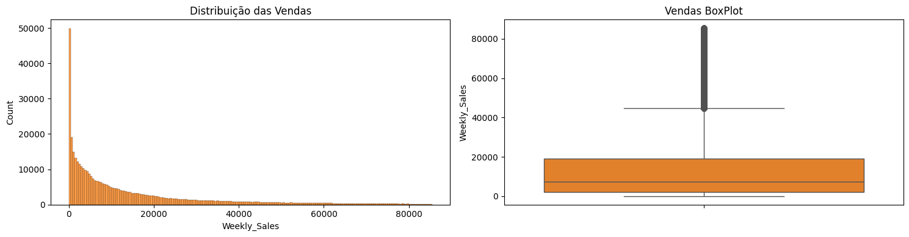
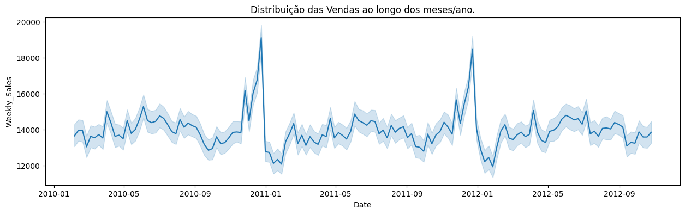
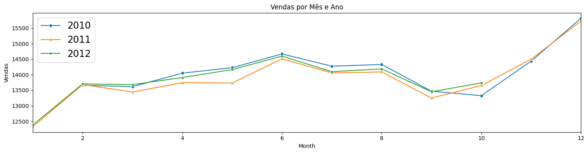
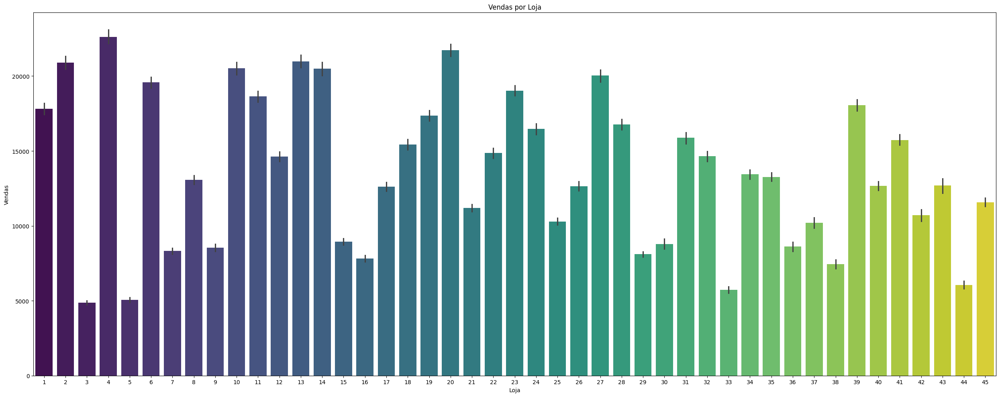
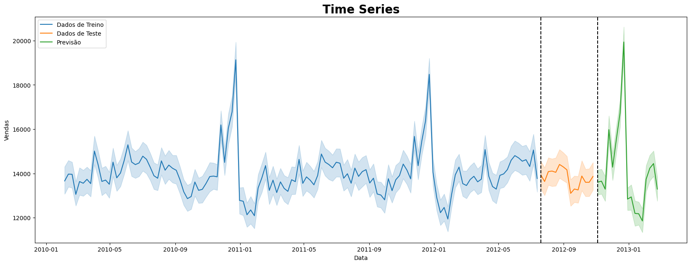

# Walmart Store Sales Forecast

## Descrição do Problema

Há estações do ano em que as vendas são significativamente maiores ou menores do que as médias. Se a empresa não souber sobre essas estações, ela pode perder muito dinheiro. A previsão de vendas dá uma ideia para a empresa organizar estoques, calcular receita e decidir fazer um novo investimento.

Um desafio da modelagem de dados de varejo é a necessidade de tomar decisões com base em histórico limitado. Se o Natal acontece apenas uma vez por ano, a chance de ver como as decisões estratégicas impactaram o resultado final também diminui.

Neste conjunto de dados a um historico de vendas de 45 lojas Walmart localizadas em diferentes regiões. Cada loja contém muitos departamentos.

## Objetivo do Projeto

O objetivo é projetar as vendas de cada departamento em cada loja para os próximos 3 meses.

## Solução

O modelo de Machine Learning construído que captou melhor a tendência de vendas nos feriados de Ação de Graça e Natal foi o LightGBM utilizando a otimização com a biblioteca Optuna.
O modelo também conseguiu capturar as tendências de queda no início do ano, apresentando um bom desempenho.

Construí uma margem de erro que garante uma acurácia de 71% nas projeções. O erro do modelo está em torno de 1631.58 unidades de vendas, com uma média de vendas de 15981.25.

Foi gerado 2 relatórios analíticos para o excel contendo: A data, a projeção e as margens de erro. No 1 primeiro contém a média de vendas por lojas e no segundo contendo as lojas e seus departamentos.

Abaixo segue algumas imagens do projeto. O projeto completo pode ser acessado clicando [aqui](https://github.com/idfelipemalatesta/walmart-store-sales-forecast/blob/main/notebooks/sales-forecast_v3.ipynb)

Analisando a distribuição da variável Vendas:

Analisando a série temporal:

Analisando a variável venda ao longo dos meses e anos:

Analisando a variável venda por loja:

Analisando a performance do modelo contendo os valores reais vs valores previstos:

Análise da série temporal contendo os dados de Treino, Teste e as Projeções:

